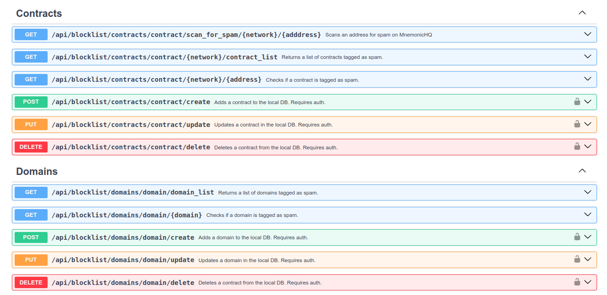

# No Phish NFTs

This repo serves an API to check if a website domain or NFT contract address has been identified as spam or otherwise malicious.

## Endpoints

<p align="center" width="100%">
    
</p>


## Setup

### Requirements

 - [Docker](https://docs.docker.com/engine/install/ubuntu/) / [w/ convenience script](https://docs.docker.com/engine/install/ubuntu/#install-using-the-convenience-script)
 - [Docker Compose](https://docs.docker.com/compose/install/linux/#install-using-the-repository)
 - Docker linux post install steps: https://docs.docker.com/engine/install/linux-postinstall/ , Configure Docker to start on boot with systemd
 - PgSQL Dependencies: `sudo apt install libpq-dev`
 - [Poetry](https://python-poetry.org/) python dependency management tool
 - 20GB+ disk space free


### Make Docker respect UFW
---
**Docker adds iptables rules that will override UFW rules!** 
Make sure to run the steps below to secure the ports used by Docker. See this article for more info: https://www.techrepublic.com/article/how-to-fix-the-docker-and-ufw-security-flaw/

Open docker config file
```
sudo nano /etc/default/docker
```

Add this line; save and exit.
```
DOCKER_OPTS="--iptables=false"
```

Restart docker
```
sudo systemctl restart docker
```

### Install API
---
- Clone repo `git clone https://github.com/smk762/no_phish_nfts`
- Create network for project with `docker network create nft-net`
- Copy `.env.example` to `.env` and populate with required environment variables
- Use `poetry install` to install dependencies
- Use `docker compose build` to build the containers
- Use `docker compose up -d` to run the containers as a daemon
- Use `docker compose logs -f --tail 33` to view runtime logs
- Use `poetry run create_tables.py` to create the `domains` and `contracts` tables. Note: This will drop existing tables if re-run later.


### Crons
---
- Add block list sources to `sources.json`
- Add custom entries in `lists/*/custom.json`
- Setup a crontab entry like `0 0 * * * poetry run /home/user/no_phish_nfts/update_lists.py` to refresh the lists every 24 hours at midnight.


### Stack
---
<p align="center" width="100%">
    <a href="https://www.postgresql.org/" alt="Contributors" style="margin:20px">
        
    </a>
    <a href="https://fastapi.tiangolo.com/" alt="Contributors" style="margin:20px">
         
    </a>
    <a href="https://www.docker.com/" alt="Contributors" style="margin:20px">
        
    </a>
</p>

### Sources
---
<p align="center" width="100%">
    <a href="https://metamask.io/" alt="Metamask" style="margin:20px">
        
    </a>
    <a href="https://developers.google.com/safe-browsing" alt="Google Safe Browsing" style="margin:20px">
         
    </a>
    <a href="https://www.alchemy.com/" alt="Alchemy API" style="margin:20px">
        
    </a>
    <a href="https://www.mnemonichq.com/" alt="MnemonicHQ API" style="margin:20px">
        
    </a>
    <a href="https://github.com/mitchellkrogza/Phishing.Database" alt="Mitchellkrogza's Phishing Database" style="margin:20px">
        
    </a>
</p>